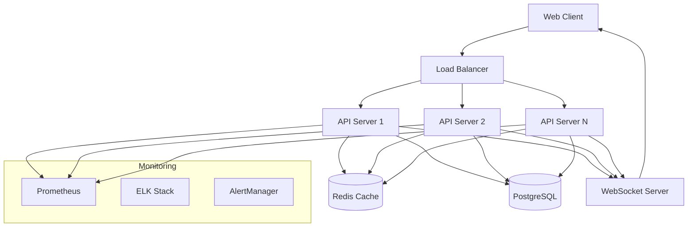
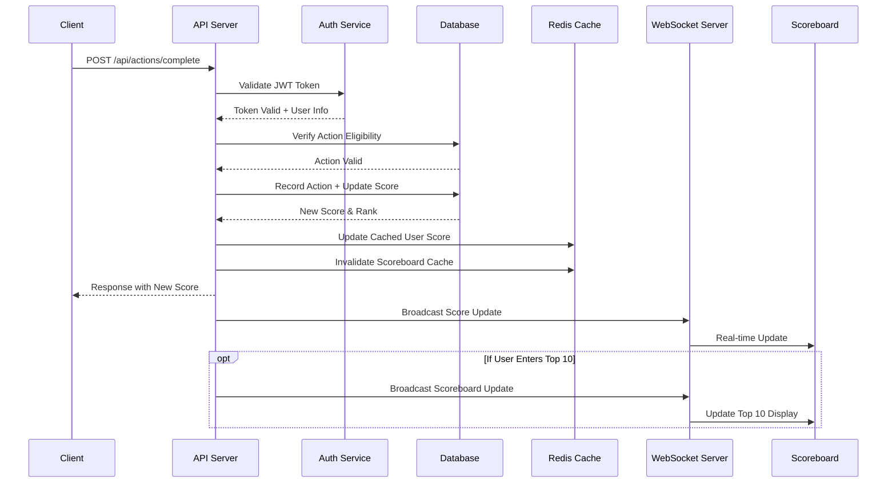
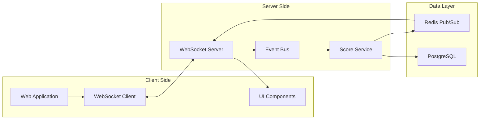
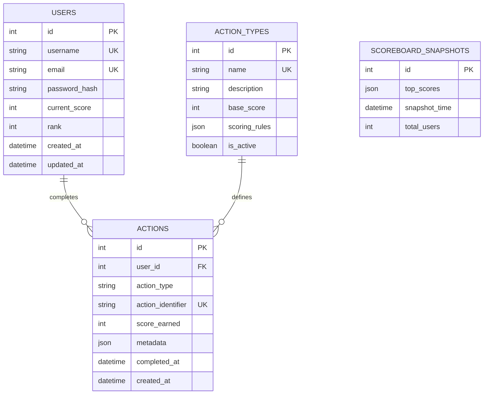
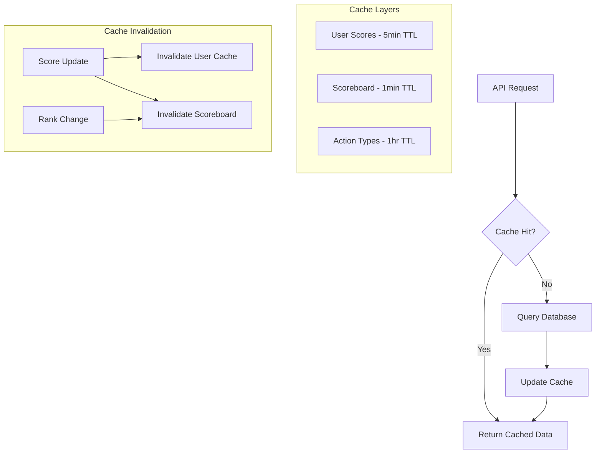
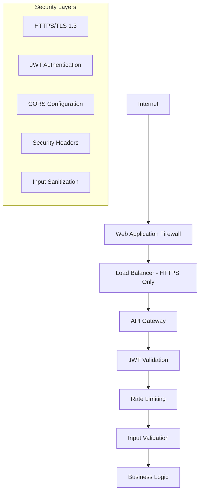

# System Architecture & Flow

## High-Level Architecture

## Action Completion Flow

## Real-time Communication Flow

## Database Schema Design

## Caching Strategy

## Scalability Considerations

### Horizontal Scaling
- **API Servers**: Stateless design allows easy horizontal scaling
- **Database**: Read replicas for improved performance
- **WebSocket Servers**: Sticky sessions or Redis adapter for Socket.IO

### Performance Optimizations
- **Connection Pooling**: Database connection pools per server instance
- **Query Optimization**: Indexed queries for scoreboard and user lookups
- **Batch Processing**: Bulk score updates for high-frequency events

### High Availability
- **Load Balancing**: Multiple API server instances
- **Database Clustering**: Master-slave PostgreSQL setup
- **Redis Clustering**: Redis Sentinel for cache high availability
- **Graceful Degradation**: Fallback to database queries if cache fails

## Security Architecture

